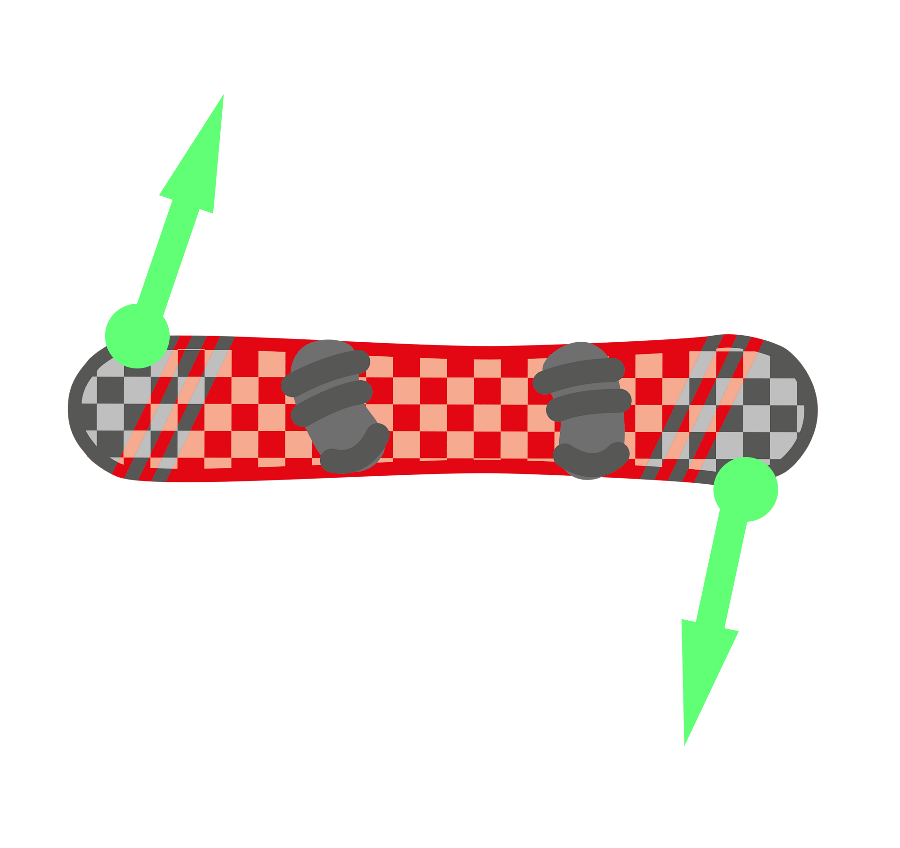

# Snowboarding
```query
children:.
```
---

**Kinda given up on snowboarding for now, far too expensive and time consuming and painful to try learn for me. A shame, but it's not worth forcing it anymore.**

Don't snowboard very often and it's quite technical with a wide variety of teaching techniques and tips, so compiling the best I've seen here.

Please keep in mind that I'm very new and terrible at snowboarding so this could all be rubbish.

## General Snowboard mechanics
**Controlling speed**<br>
There are two main ways of controlling speed:

* Lowering/raising your feet/ankles
* Lowering/raising your torso

Digging your feet into the snow is a sure way to slow you down, but this is usually a very drastic movement and produces jerky motion.

Lowering and raising your torso to put more weight over the edge of your board is more easily fine-tuned and can produce smooth motion. For heel-side this is a further exaggeration of the "sitting" posture, while for toe-side this is leaning further into the front of your boots.

**Rotation**<br>
Rotation is produced by twisting the board such that one of the board's edge is dragging less than the other. I find it much easier to think of the board rotating rather than me turning, because me turning means something very different when coming out of a sideslip compared to a traverse.

Regarding the **feet/ankes**, the board always rotates in the direction the foot is being pressed down:



To produce this rotation, don't use your ankles, which are far more difficult to control and are fairly weak. Instead use your **knees**, where your fore knee (left for me) rotates either "out and back" (putting more pressure on the heel) or "in and forward" (putting more pressure on the toe), and the aft knee follows by doing the opposite.

To help understand the board rotation direction, pretend there is a laser on the outsides of your knees, how they point shows the next angle the board is heading towards.

Remember to keep you hip and upwards still aligned with the board, it's only the knees down that should be moving. The hip may make a small rotation if it helps, but not at all as drastic as what the knees do.

## General Posture
* Torso straight over edge of board
* Vertical from hip upwards
* Arms over sides of board
* Don't look down

## Traverses
* Rotate the board to desired angle
* Lean slightly toward fore of board with hips
* Set height such that you aren't skidding but aren't stopping - are instead gripping or carving
* Look where you want to go

## Turns
* From a traverse, rotate the board, really exaggerating knees
* Rollover to new edge
* Hips slightly aft while heading into new traverse angle
* Back to traverse

## Lifts
* When hanging, rest board on non-bound foot
* When approaching ground
  * Turn slightly to have front foot go first
  * Prepare back foot for skating
* When at ground, place board on snow while holding chair with back hand (right hand)
* Skate away from lift area